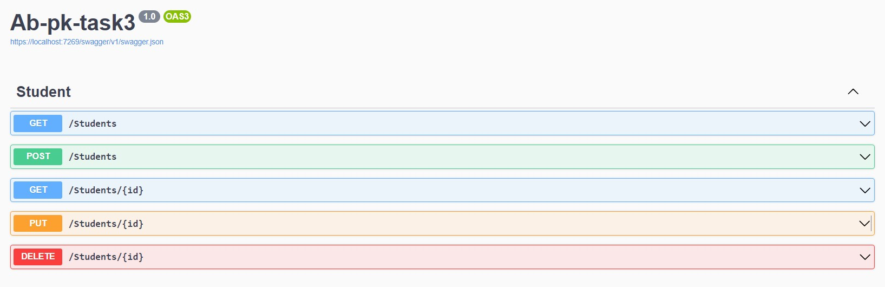
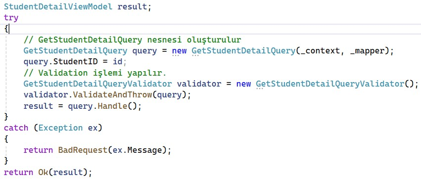
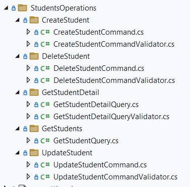

# Akbank .Net Bootcamp Cohort Görev 3

Akbank ve patikadev tarafından gerçekleştirilen Asp.Net eğitimi sürecinde verilen cohort üzerinden verilen üçüncü görev.

-   [Akbank .Net Bootcamp Cohort Ödev 1 GitHub linki](https://github.com/ysfArslan1/Ab-pk-week1)
-   [Akbank .Net Bootcamp Cohort Ödev 2 GitHub linki](https://github.com/ysfArslan1/Ab-pk-week2)

## Bizden İstenenler:
Fluent Validation kütüphanesini kullanarak Update, Delete ve GetById metotları için validation sınıflarını yazınız. Controller içerisinde metot çağrımlarından önce validasyonları çalıştırınız.

## Validation sınıflarının oluşturulması ve Controllerda kullanılması:
İstenilen istekler doğrultusunda GetStudentDetailQueryValidator, CreateStudentCommandValidator, UpdateStudentCommandValidator, DeleteStudentCommandValidator sınıflarını oluşturdum ve StudentController içerisinde kullandım.

